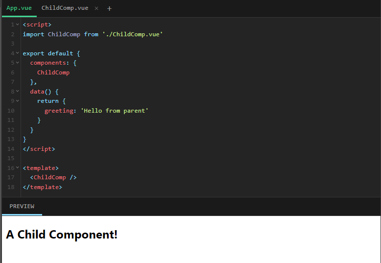
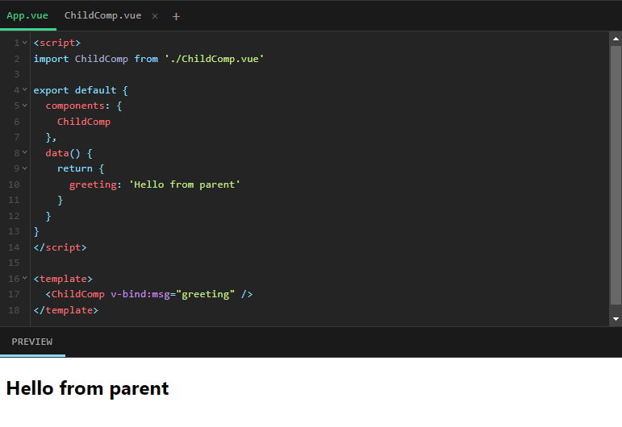
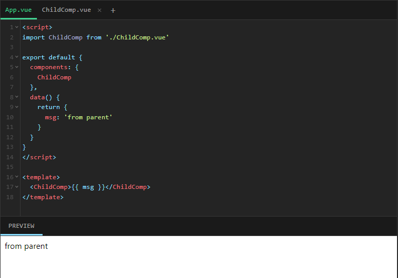

# Vue Studies

# Documentacion drafts

- [API STYLES](https://vuejs.org/guide/introduction.html#api-styles)
- SFC: Single-File Component
- O principal recurso do Vue é a Declarative Rendering: usando uma sintaxe de modelo que estende o HTML, podemos descrever como o HTML deve se parecer com base no estado do JavaScript. Quando o estado muda, o HTML é atualizado automaticamente.
- Mustaches syntax: `<h1>{{ message }}</h1>`

## Tutorial

- ### Step 2 - Declarative Rendering
  
- ### Step 3 - Attribute Bindings (v-bind)
  
- ### Step 4 - Event Listeners (v-on)
  
- ### Step 5 - Form Bindings
  
- ### Step 6 - [Conditional Rendering](https://vuejs.org/guide/essentials/conditional.html)
  
  
- ### Step 7 - List Rendering

  ```
  <script>
  // give each todo a unique id
  let id = 0

  export default {
    data() {
      return {
        newTodo: '',
        todos: [
          { id: id++, text: 'Learn HTML' },
          { id: id++, text: 'Learn JavaScript' },
          { id: id++, text: 'Learn Vue' }
        ]
      }
    },
    methods: {
      addTodo() {
        this.todos.push({id: id++, text: this.newTodo})
        this.newTodo = ''
      },
      removeTodo(todo) {
        this.todos = this.todos.filter((element) => element !== todo)
      }
    }
  }
  </script>

  <template>
    <form @submit.prevent="addTodo">
      <input v-model="newTodo">
      <button>Add Todo</button>
    </form>
    <ul>
      <li v-for="todo in todos" :key="todo.id">
        {{ todo.text }}
        <button @click="removeTodo(todo)">X</button>
      </li>
    </ul>
  </template>
  ```

  

- ### Step 8 - Computed Property

  ```
  <script>
  let id = 0

  export default {
    data() {
      return {
        newTodo: '',
        hideCompleted: false,
        todos: [
          { id: id++, text: 'Learn HTML', done: true },
          { id: id++, text: 'Learn JavaScript', done: true },
          { id: id++, text: 'Learn Vue', done: false }
        ]
      }
    },
    computed: {
      filteredTodos() {
        return this.hideCompleted
          ? this.todos.filter((t) => !t.done)
          : this.todos
      }
    },
    methods: {
      addTodo() {
        this.todos.push({ id: id++, text: this.newTodo, done: false })
        this.newTodo = ''
      },
      removeTodo(todo) {
        this.todos = this.todos.filter((t) => t !== todo)
      }
    }
  }
  </script>

  <template>
    <form @submit.prevent="addTodo">
      <input v-model="newTodo">
      <button>Add Todo</button>
    </form>
    <ul>
      <li v-for="todo in filteredTodos" :key="todo.id">
        <input type="checkbox" v-model="todo.done">
        <span :class="{ done: todo.done }">{{ todo.text }}</span>
        <button @click="removeTodo(todo)">X</button>
      </li>
    </ul>
    <button @click="hideCompleted = !hideCompleted">
      {{ hideCompleted ? 'Show all' : 'Hide completed' }}
    </button>
  </template>

  <style>
  .done {
    text-decoration: line-through;
  }
  </style>
  ```

  
  

- ### Step 9 - Lifecycle and Template Refs

  

- ### Step 10 - Watchers

  ```
  <script>
  export default {
    data() {
      return {
        todoId: 1,
        todoData: null,
        actualId: ''
      }
    },
    methods: {
      async fetchData() {
        this.todoData = null
        const res = await fetch(
          `https://jsonplaceholder.typicode.com/todos/${this.todoId}`
        )
        this.todoData = await res.json()
      }
    },
    mounted() {
      this.fetchData()
    },
    watch: {
      todoId(actualTodoId) {
        this.fetchData()
        this.actualId = actualTodoId
      }
    }
  }
  </script>

  <template>
    <p>Todo id: {{ todoId }}</p>
    <button @click="todoId++">Fetch next todo</button>
    <p v-if="!todoData">Loading...</p>
    <pre v-else>{{ todoData }}</pre>
    <p>
      {{ actualId }}
    </p>
  </template>
  ```

  

- ### Step 11 - Components

  
  

- ### Step 12 - Props

  
  

- ### Step 13 - Emits

  
  

- ### Step 14 - Slots
  
  
  
